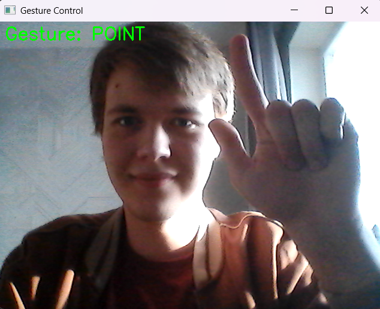

# Gesticulator 👌

---

## 📝 О проекте

**Жестикулятор** - программа на Python, которая позволяет управлять мышью компьютера в реальном времени с помощью жестов. Проект использует библиотеки OpenCV для захвата видеопотока веб-камеры, MediaPipe для детекции ключевых точек руки и PyAutoGUI для эмуляции действий мыши.

### Идея

**Идея проекта** — предоставить удобный способ взаимодействия с компьютером, не требующий клавиатуру, мышь или сенсорный экран, что может быть полезно в ситуациях, где физический контакт с этими устройствами затруднен, нежелателен или невозможен.

### Логика работы

Программа работает по следующему алгоритму:
	1. Пользователь показывает жест 
	2. Программа захватывает видеопоток с веб-камеры 
    3. ML модель MediaPipe ищет в видеопотоке ладонь и возвращает координаты 21 специальной точки
    4. На основе этих координат разработанный алгоритм определяет, какой жест показывает пользователь
    5. Исходя из этого жеста, программа эмулирует действия мыши 


---

## ✨ Возможности

- Перемещение курсора — жест POINT ☝️.
- Левый клик — жест VICTORY ✌️.
- Правый клик — жест ROCK 🤘.
- Завершение программы — жест STOP (как жест VICTORY но с добавлением безымянного пальца).
- Включить/выключить отображение FPS - клавиша t.
- Включить/выключить отрисовку скелета руки и контрольных точек - клавиша d.



---

## ⚙️ Технологии
- Python 3.13+
- MediaPipe — детекция и отслеживание руки.
- OpenCV — захват видео с камеры и отображение.
- PyAutoGUI — управление мышью.
- Threading — для плавного перемещения курсора.

---

## 🚀 Установка и запуск программы

1. Убедитесь, что установлен Python 3.10 или новее.
2. Откройте терминал:
    - Нажмите сочетание клавиш Win + r
    - В появившемся окне введите cmd
    - Появится окно с терминалом
3. Склонируйте репозиторий:
``` bash
git clone https://github.com/StepanSorokin1/Gesticulator.git
```
4. Перейдите в папку с проектом:
``` bash
cd Gesticulator
```
5. Установите зависимости:
``` bash
pip install -r requirements.txt
```
6. Запустите программу:
``` bash
python main.py
```
7. Покажите руку перед камерой — начнётся отслеживание!

---

## 👆 Управление жестами

|Жест	|Какие пальцы надо поднять (Остальные надо сжать)|Действие                                                                  |
|:------|:-----------------------------------------------|:-------------------------------------------------------------------------|
|POINT  |Указательный (большой по желанию)               |Перемещение курсора мыши (Курсор следует за кончиком указательного пальца)|
|VICTORY|Указательный, средний (большой по желанию)      |Левый клик мыши                                                           |
|ROCK	|Указательный, мизинец (большой по желанию)      |Правый клик мыши                                                          |
|STOP   |Указательный, средний, безымянный               |Завершение программы                                                      |
|UNKNOWN|Любой другой жест                               |Инорируется                                                               |

---

## 📁 Структура проекта

```
Gesticulator/
├── camera.py               # Работа с камерой (захват кадров)
├── constants.py            # Все константы и настройки
├── gesture_controller.py   # Логика обработки жестов и управление мышью
├── gesture_tracker.py      # Определение поднятых пальцев и распознавание жестов
├── hand_tracker.py         # Взаимодействие с MediaPipe (детекция руки)
├── main.py                 # Главный цикл приложения
├── mouse.py                # Управление мышью через PyAutoGUI
├── hand_landmarker.task    # Загруженная модель MediaPipe
├── requirements.txt        # Зависимости Python
└── README.md               # Этот файл
```
---

## 🙏 Внесение вклада
- Любые улучшения приветствуются! Если вы хотите помочь, не стесняйтесь форкать репозиторий
- Проект создан в образовательных целях. Распространяется свободно. 
- Автор: Степан Сорокин 
- Контакт Маха для связи с автором: https://max.ru/u/f9LHodD0cOLNdJVDT40G8aEv1CdHlgN9x17Z4t99TPJfKoxO0ssa43HWnIY